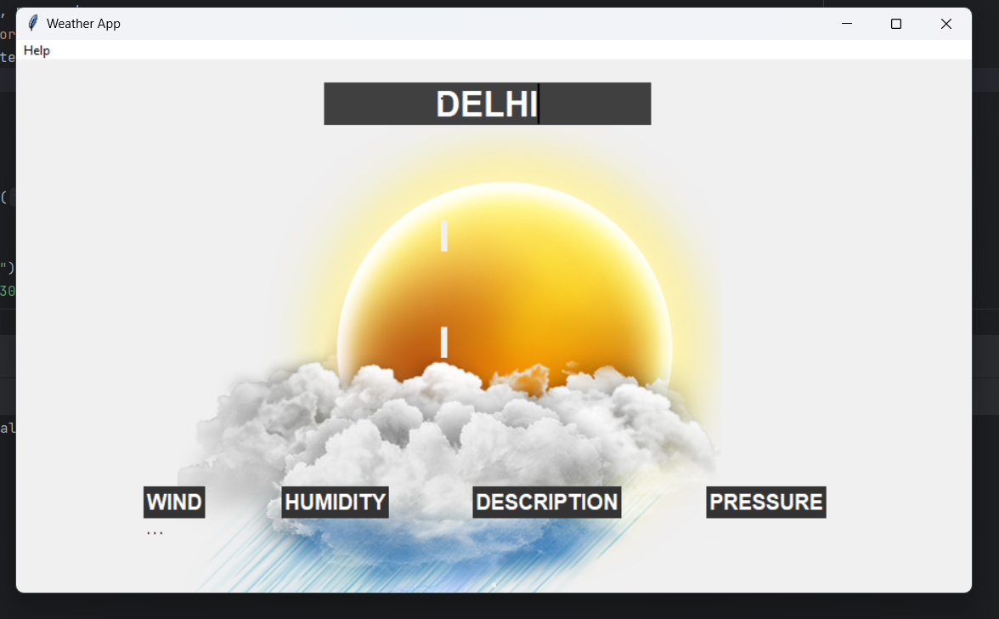

# Weather App v1.0

Weather App v1.0 is a desktop application built using Python and Tkinter for displaying real-time weather information. Enter a city name, and it provides you with current weather conditions including temperature, wind speed, humidity, and a brief description of the weather.

## Technologies Used

### Python

The application is scripted in Python, a powerful, easy-to-learn, and widely used programming language.

### Tkinter

Tkinter is Python's standard GUI (Graphical User Interface) package. It is fast and easy to use and is included in Python's standard library.

### OpenWeatherMap API

The real-time weather data is fetched using the OpenWeatherMap API. It provides current weather data, forecasts, now casts and historical weather data to the developers of web services and mobile applications.

### Other Libraries

- **Pandas**: Used for data manipulation and analysis.
- **Geopy**: Used to locate the coordinates of addresses, cities, countries, and landmarks across the globe using third-party geocodes and other data sources.
- **timezonefinder**: A fast library for finding the timezone of any point on earth (coordinates) offline.
- **pytz**: World Timezone Definitions for Python.
- **requests**: Allows you to send HTTP requests using Python.

## Features

- **Real-Time Weather Data**: Get up-to-date weather information.
- **User Friendly**: Easy to use interface, just enter the city name.
- **Accurate Results**: Utilizes OpenWeatherMap API for precise weather data.

## Screenshots

()

## SHOW SOME LOVE TO THIS REPO 

                                                                                                       BY SHUBHAM KUMAR 

